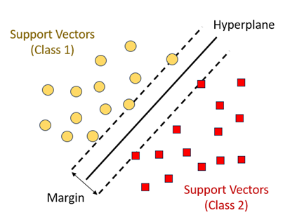

=====================
COASTAL GEOMORPHOLOGY
=====================

-------------
Introduction
-------------
Coastal geomorphology monitoring is essential for understanding the dynamic changes in coastal landscapes. This documentation focuses on the classification of terrestrial classes in the Indian Ocean Island countries, namely Madagascar, Comoros, Seychelles, and Mauritius. The identified classes for both terrestrial and benthic cover contributes to comprehensive coastal monitoring efforts.

--------------------------
Study Area and Importance
--------------------------
The Indian Ocean islands exhibit diverse coastal features, making them vulnerable to natural and anthropogenic influences. Monitoring these areas is crucial for sustainable development, environmental conservation, and disaster risk reduction.

The study focuses on the coastal regions of Madagascar, Comoros, Seychelles, and Mauritius. These islands exhibit diverse coastal landscapes, including beaches, mangroves, and wetlands, making them ideal for comprehensive geomorphological analysis.

----------------------------
Data Source and Methodology
----------------------------
The study on land cover relies on Sentinel-2 satellite data, known for its high-resolution and multispectral capabilities

-----------------
Data Acquisition
-----------------
Sentinel-2 is a series of Earth observation satellites developed by the European Space Agency (ESA) as part of the Copernicus program. These satellites are equipped with a high-resolution multispectral imaging system, capturing data in various spectral bands. The key aspects that make Sentinel-2 imagery invaluable for land cover classification include:

^^^^^^^^^^^^^^^^^^^^
Spatial Resolution:
^^^^^^^^^^^^^^^^^^^^
Sentinel-2 provides high spatial resolution, allowing for detailed and precise observations of the Earth's surface. This is crucial for distinguishing fine-scale features in coastal areas, such as beaches, mangroves, and wetlands.

^^^^^^^^^^^^^^^^^^^^^
Multispectral Bands:
^^^^^^^^^^^^^^^^^^^^^
The satellite captures data across multiple spectral bands, including visible, near-infrared, and shortwave infrared. This multispectral capability enables the extraction of diverse information about the land surface, making it possible to discriminate between different land cover types based on their unique spectral signatures.

^^^^^^^^^^^^^^^^^^^
Temporal Coverage:
^^^^^^^^^^^^^^^^^^^
Sentinel-2 has a revisit time of a few days, ensuring frequent acquisition of imagery for a given area. This temporal coverage is vital for monitoring changes over time, such as seasonal variations and dynamic coastal processes.

^^^^^^^^^^^^^^^^^^^^
Open Access Policy:
^^^^^^^^^^^^^^^^^^^^
The Copernicus program adopts an open access policy, making Sentinel-2 data freely available to users worldwide. This accessibility promotes widespread use and facilitates research and monitoring activities globally.

-------------------
Pre-processing:
-------------------
In the initial steps of data acquisition, critical phase of preprocessing  the acquired data was conducted to enhance the image quality in order to achieve the desired results in the processes that followed
These steps, performed within the Google Earth Engine environment, were aimed at ensuring the subsequent land cover classification would be conducted on high-quality, relevant information.

The temporal and cloud cover constraints, once established, played a pivotal role in refining the dataset. By limiting the imagery to a specific time frame — from January 1, 2022, to December 30, 2022 — and setting a maximum cloud probability of 20%, the script ensured that the selected images were both temporally relevant and minimally affected by cloud cover.

To enhance the accuracy of subsequent analyses, two essential masking functions were defined. The maskClouds function utilized cloud probability information to mask out cloudy pixels. This step was crucial in mitigating the impact of cloud interference on the quality of the land cover classification results. Simultaneously, the maskEdges function addressed potential artifacts at scene edges by applying masks derived from 20m and 60m bands, systematically excluding undesirable data from the analysis.

With the filtered and masked data in hand, the script proceeded to the integration of cloud probability information into the Sentinel-2 surface reflectance collection. This integration, achieved through the joining of datasets and subsequent cloud masking, further refined the dataset, ensuring that only the highest-quality pixels were considered for subsequent analysis.

The selection of specific spectral bands (Blue, Green, Red, and NIR) and the definition of visualization parameters were pivotal steps in preparing the imagery for visual inspection. By adding the resulting imagery to the map with a focus on these selected bands, the script facilitated a detailed and insightful visual assessment of the Sentinel-2 data, setting the stage for subsequent land cover classification and comprehensive coastal geomorphology monitoring.

-----------------------------------------------
Classification Process: A Detailed Overview
-----------------------------------------------
The classification process is a critical component of coastal geomorphology monitoring, employing a machine learning approach to derive land cover maps from Sentinel-2 satellite imagery. The process is encapsulated by the general equation: data + Trained model = map. This equation represents the core workflow, where the spectral information of individual pixels from the Sentinel-2 imagery is evaluated and classified based on a model trained on labeled data.

^^^^^^^^^^^^^^^^^
Data Collection:
^^^^^^^^^^^^^^^^^
The term "data" in the equation refers to the collection of individual pixels from a multi-band Sentinel-2 image of unknown class. These pixels represent the raw information used as input for the classification model. Each pixel encapsulates spectral data from different bands, capturing the unique signature of the earth surface under observation.

^^^^^^^^^^^^^^^^^^^^^^^^^^^^
Trained Model Construction:
^^^^^^^^^^^^^^^^^^^^^^^^^^^^
The variable "Trained model" is the result of an intricate process involving labeled data and model architecture. The labeled data consists of a multiband image where the land use or land cover is known. This labeled dataset is crucial for training the classification model. The equation for this step is: labeled data + model architecture = trained model.

^^^^^^^^^^^^^^^^^^^^^^^^^^^^^^^^^^^^^^^
Labeled Data: A Ground Truth Reference
^^^^^^^^^^^^^^^^^^^^^^^^^^^^^^^^^^^^^^^
The training data consists of labeled samples from various geographical locations across the study area. The labeled data is akin to the initial data, but with a crucial difference — each pixel's land cover class is known. 

This dataset serves as a ground truth reference during the training phase, allowing the model to learn the spectral patterns associated with different land cover types. For each training point, spectral signatures are extracted at that point, which build a training sample for the next step in machine learning algorithm.

Adequate labeled data helps in mitigating bias in the model's predictions. Bias can arise when the training data is not representative of the true distribution of the target classes. A diverse set of labeled examples helps ensure that the model does not become skewed towards certain classes, providing a more unbiased and accurate representation of the landscape. In the context of machine learning, algorithms typically require numeric input. This necessitates converting categorical labels, such as land cover or land use names, into numeric values. This process is known as label encoding or one-hot encoding

^^^^^^^^^^^^^^^^^^^^^^^^^^^^^^^^^^^^^^^^^^^^^
1. Model Architecture: Choosing the Best Fit
^^^^^^^^^^^^^^^^^^^^^^^^^^^^^^^^^^^^^^^^^^^^^
The choice of model architecture significantly influences the performance of the classification model. In this study, the selection was made between two powerful algorithms: Random Forest and Support Vector Machines (SVM). The decision was based on their comparative performance during the training phase, with the goal of choosing the model that best captures the complex relationships within the data.

The model that demonstrates superior performance during the evaluation phase is selected for land cover classification. This chosen model encapsulates the knowledge gained from the training data and is ready for application to the entire study area.

^^^^^^^^^^^^^^^^^^^^^^^^^^^^^^^^^^^^^^^^^^^^^^^^^^^^^^^^^^^^^^^
5. Classification: Applying the Trained Model to Generate Maps
^^^^^^^^^^^^^^^^^^^^^^^^^^^^^^^^^^^^^^^^^^^^^^^^^^^^^^^^^^^^^^^
With the trained model in place, the next step is applying it to the initial, unlabeled Sentinel-2 image. The equation initial data + trained model = map comes into play. 

For each pixel in the Sentinel-2 imagery, the trained model evaluates the spectral information from the input bands and assigns a land cover class based on the learned patterns from the training data

-------------------------------------------------------
Land Cover Map: Deriving INsights from Spatial Paterns
-------------------------------------------------------

The output of the classification process is a high-resolution land cover map. This map provides spatial insights into the distribution of the following terrestrial classes:

•	Barren: Represents areas with minimal vegetation cover, aiding in the identification of desolate regions.

•	Beach: Indicates the sandy coastal regions, vital for understanding erosion and sedimentation patterns.

•	Cropland: Identifies cultivated areas along the coast, facilitating agricultural monitoring.

•	Forest and Grassland: Highlights vegetative cover, essential for biodiversity assessment and ecosystem health monitoring.

•	Mangroves: Crucial for coastal protection, the mapping of mangroves aids in conservation efforts.

•	River-Creek: Identifies watercourse patterns, contributing to hydrological studies.

•	Road and Settlement: Enables urbanization monitoring and infrastructure development assessment.
•	Stony: Recognizes areas with rocky or stony substrates along the coast.

•	Water and Wetland: Indicates wetland areas, supporting biodiversity and water quality studies.

-------------
Coastal Zone
-------------

According to the ICZM Protocol, the coastal zone is defined as 'a geomorphologic area either side of the seashore in which the interaction between the marine and land parts occurs in the form of complex ecological and resource systems made up of biotic and abiotic components co-existing and interacting with human communities and relevant socio-economic activities.' The shore is comprised of the backshore and foreshore. The backshore, itself, is essentially comprised of a berm, which is a gently sloping dry portion of the beach.

Tidal fluctuation causes the shoreline to migrate back and forth within the shore range, forming longshore bars near the low tide breaker line. The longshore bar demarcates the region between the nearshore zone and offshore region.

---------------
Types of Reefs
---------------

The Indian Ocean Islands investigated are protected by coral reef systems. These are mainly grouped into 3 main types:

^^^^^^^^^^^^^^
Fringing Reef
^^^^^^^^^^^^^^

Typically occur adjacent to land, with little or no separation from the shore and forms a shallow lagoon.

^^^^^^^^^^^^^
Barrier Reef
^^^^^^^^^^^^^

Broader and separated from land by a lagoon extending some kilometers wide. These extend as a broken, irregular ring around the coast or an island, running almost parallel to it.

^^^^^^^^^^^
Atoll Reef
^^^^^^^^^^^

An atoll is a roughly circular (annular) oceanic reef system surrounding a large (and often deep) central lagoon.

-------------------------------------
Reef Zonation and Geomorphic Classes
-------------------------------------

The reef area is comprised of:

^^^^^^^^^^^^^^^^^^^^^^
Terrestrial Reef Flat
^^^^^^^^^^^^^^^^^^^^^^

Broad, flat, shallow to semi-exposed area attached to land at one side, and subject to freshwater run-off, nutrients, and sediment.

^^^^^^^
Lagoon
^^^^^^^

Sheltered, flat-bottomed sediment-dominated area (shallow < 5m; Deep >5m).

^^^^^^^^^^^^^^^^
Inner Reef Flat
^^^^^^^^^^^^^^^^

Low energy, sediment-dominated, horizontal to gently sloping platform.

^^^^^^^^^^^^^^^^
Outer Reef Flat
^^^^^^^^^^^^^^^^

A near horizontal, broad, and shallow platform which dissipates a significant portion of the remaining wave energy.

^^^^^^^^^^^
Reef Crest
^^^^^^^^^^^

It is the highest point of the reef, generally shallow and characterized by the highest wave energy absorbance.

^^^^^^^^^^^
Reef Slope
^^^^^^^^^^^

Reef slope is a submerged, sloping area extending seaward from the reef crest.

^^^^^^^^
Plateau
^^^^^^^^

Deeper submerged (> 5 m), hard-bottomed, horizontal to gently sloping (<10°), seaward facing reef platform.

In contrast to the fringing reef in figure 2 above, the barrier reef has a deeper lagoon section and an extended reef structure. This is depicted in figure 3 below.

-----------------
Coastal Landform
-----------------

The coastal landform comprises a diverse range of ecosystems and morphologies. These include:

^^^^^^^^^^^^^^^^^^^^^^
Beach and Dune System
^^^^^^^^^^^^^^^^^^^^^^

The beach comprises the foreshore and backshore, while the dune comprises the fixed, the shifting, and the embryonic dunes.

^^^^^^^^^^^^^^^^
Muddy Shoreline
^^^^^^^^^^^^^^^^

Present as tidal mud flats, they are composed of silt, clay, or fine sand. These generally form where tidal current velocities are too weak to resuspend completely the mud.

^^^^^^^^^^^^^^^^
Rocky Shoreline
^^^^^^^^^^^^^^^^

These originate from the rapid cooling and hardening of volcanic lava outflows into the sea. A rocky shore is an intertidal area of seacoasts where solid rock predominates. They are mostly basaltic in nature.

^^^^^^^
Cliffs
^^^^^^^

It is a high area of rock with a very steep side, at the edge of the sea. Cliffs are formed as erosion landforms due to the processes of erosion and weathering.

^^^^^^^^^^^^^^^^^^^^^^^^^^^^^^
Saltmarshes (Coastal Wetland)
^^^^^^^^^^^^^^^^^^^^^^^^^^^^^^

Saltmarshes are coastal wetlands dominated by high vegetation that are periodically inundated by saltwater. They are marshy because the soil may be composed of deep mud and peat (plant matter in decomposition).

^^^^^^^^^^^^^^^^^^^^^
Cobble/Shingle Beach
^^^^^^^^^^^^^^^^^^^^^

These occur principally on high wave energy shores and originate from cliff erosion of moderate to strong bedrock. Generally, cobble beaches are much steeper than sandy beaches and provide natural defense to shore.

^^^^^^^^^^^^^^^^^^^^^^^^^^^
Calcareous Limestone Shore
^^^^^^^^^^^^^^^^^^^^^^^^^^^

It is a carbonate sedimentary rock essentially composed of minerals calcite and aragonite (formed by the fragmentation of shell, coral, algal, and other organic debris).

^^^^^^^^
Estuary
^^^^^^^^

An estuary is a partially enclosed area of water on the coast where saltwater from the sea mixes with fresh water from rivers and streams.

----------------
Benthic Habitat
----------------

The benthic ecosystems comprise essentially of:

^^^^^^^
Corals
^^^^^^^

Having survived several mass extinctions, corals are animals (marine invertebrates) despite having a plant-appearance. The coral animals are referred to as polyps and are colonial in nature, being hosted on calcium carbonate skeletons. All polyps exist in harmony on the same calcium carbonate skeleton. Coral polyps have tentacles with nematocyst – stinging cells to catch preys, even small fish (~10% of food source). Symbiotic algae living inside the coral polyp tissue (zooxanthellae) provide ~90% of food source through photosynthesis. The zooxanthellae is also responsible for giving the corals their pigmentation.

^^^^^^^^^^^^^^
Algae/Seaweed
^^^^^^^^^^^^^^

Algae are photosynthetic organisms that contain chlorophyll pigments. They lack the typical roots, stems, and leaves of vascular plants. They are not classified as plants. Instead, they fall into the group of protists and can be unicellular (Phytoplankton) or multicellular (macroalga seaweed). The most common types of algae include: (1) Brown algae/kelp (Shallow-Intermediate seawater); (2) Green algae (mostly in freshwater); Red algae (Deep seawater).

^^^^^^^^^
Seagrass
^^^^^^^^^

Seagrass are flowering plants that are found in shallow coastal seawater and can develop into dense meadows. They play a vital role in stabilizing the coastline and minimizing sediment movement that may lead to erosion areas. They have important carbon sequestration properties – 4000 m² sequesters 550 kg equivalent carbon annually (Equivalent to a car traveling twice the distance from Madagascar, Comoros, Seychelles, and Mauritius).

---------------------------------------
Geomorphological Classification Scales
---------------------------------------

Based on the review of existing coastal features in the Indian Ocean Island Countries, the following Classification Scales are employed for terrestrial and benthic features of the coast.

------------
Methodology
------------

The framework for the classification of coastal features is presented in Fig. 8. Sentinel 2 data is sourced and employed in the creation of a land and an ocean mask (about 5km from the shoreline). Terrestrial features are thereafter classified using a supervised classification technique (Maximum Likelihood or Support Vector Machine). Signature files are created using a sample set of control points for each feature. The result of the supervised classification is then validated against surveyed and literature sources. A manual correction is then undertaken to refine the classification of the classified features.

Benthic features are classified from the extracted Sentinel 2 image using the ocean mask. A depth invariant index algorithm is applied to correct for the water column and enhance the accuracy of classification. A supervised classification technique is employed to delineate known features, including seagrass, underwater sediments, amongst others. An unsupervised k-means classification is used to detect unidentified classes. Validation and manual correction follow to ensure the correctness of the benthic classifications.

--------------------------
Supervised Classification
--------------------------

Satellite sensors use the unique reflectance properties of distinct terrestrial features that permit delineation and characterization of their extents. Sentinel 2 high-resolution, multi-spectral images are used and consist of 13 spectral bands that range from the visible range to the shortwave infrared (SWIR). Supervised Classification: This process necessitates the user to manually interpret an image through grouping of grid cells that share common spectral reflectance. The classification procedures are summarized essentially in 3 main stages:

1. Using visual interpretation, the spectral signature for a geomorphological class is defined → Training set for a class
2. A classification algorithm is thereafter utilized and employs the training class to identify grid cells belonging to that spectral class
3. The range of numerical spectral signature values (R,G,B,NIR,…) belonging to distinct feature classes are used to categorize and group cells sharing common spectral properties

--------------------------
Classification Algorithms
--------------------------

^^^^^^^^^^^^^^^^^^^^^^^^^^^^^^^^^^^^^^^^
Maximum Likelihood Classification (MLC)
^^^^^^^^^^^^^^^^^^^^^^^^^^^^^^^^^^^^^^^^

The algorithm assumes that the distribution for respective feature classes in each band follows a normal curve and determines the probability that a random pixel belongs to a certain class.

^^^^^^^^^^^^^^^^^^^^^^^^^^^^^
Support Vector Machine (SVM)
^^^^^^^^^^^^^^^^^^^^^^^^^^^^^

SVM performs the classification by drawing a hyperplane. The hyperplane is drawn in such a way as to maximize the distance to points in either class (referred to as the margin).

^^^^^^^^^^^^^^
Random Forest
^^^^^^^^^^^^^^

This algorithm works by building multiple decision trees and then merging them together to get more stable and accurate predictions. A training dataset is used and labelled into a decision tree, with an underlying set of rules that will aid in the classification process.

----------------------------
Unsupervised Classification
----------------------------

In unsupervised classification, no training dataset is required. Instead, the user specifies the number of classes and an algorithm automatically groups the classes that share similar statistical behavior. The most used clustering technique is the k-means method.

-----------------------------------
Reflectance and Spectral Signature
-----------------------------------

The spectral information of features is used to distinguish between them. Energy from the sun is absorbed and reflected by features on earth, which are thereafter detected and measured. Each feature reflects energy to different extents owing to their chemical and structural compositions (Spectral Reflectance). These are interpreted and used to classify coastal terrestrial features.

Capturing the individual feature spectrum is relatively more complex than the terrestrial components. The outgoing radiation from the shallow water has the contribution of both the water column and bottom substrate. Water column correction is therefore applied in case the shallow lagoon section is murky. A Depth Invariant Index algorithm is employed in that regard. The distinction in spectral reflectance of different features helps identify benthic components.

-----------
References
-----------

Coastal zone. Available on: https://commons.wikimedia.org/wiki/File:Littoral_Zones.jpg

Coral polyp. Available on: https://commons.wikimedia.org/wiki/File:Coral_polyp_it.svg

Hedley, J.D., et al., Spectral unmixing of coral reef benthos under ideal conditions. Coral Reefs, 2004. 23(1): p. 60-73 Noel Gorelick, Matt Hancher, Mike Dixon, Simon Ilyushchenko, David Thau, Rebecca Moore, Google Earth Engine: Planetary-scale geospatial analysis for everyone, Remote Sensing of Environment, Volume 202,2017, Pages 18-27ISSN 0034-4257,https://doi.org/10.1016/j.rse.2017.06.031.(https://www.sciencedirect.com/science/article/pii/S0034425717302900)

Szantoi, Z. and Strobl, P., Copernicus Sentinel-2 calibration and validation, EUROPEAN JOURNAL OF REMOTE SENSING, ISSN 2279-7254, 52 (1), 2019, p. 253-255, JRC115729.

