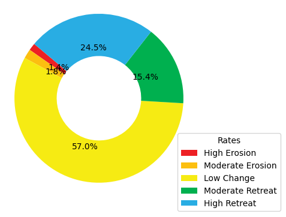
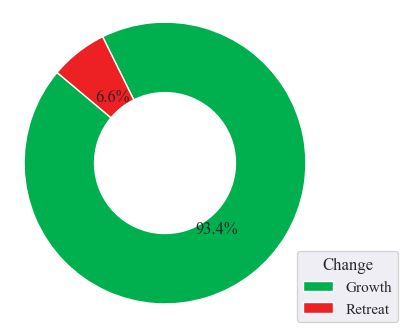
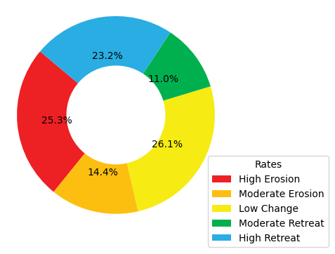
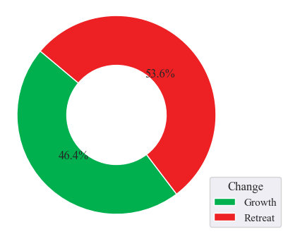
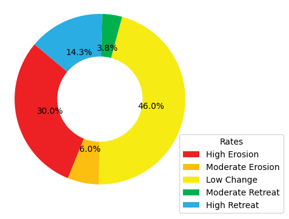
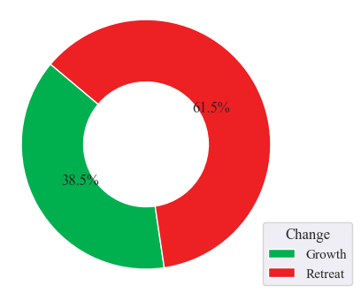
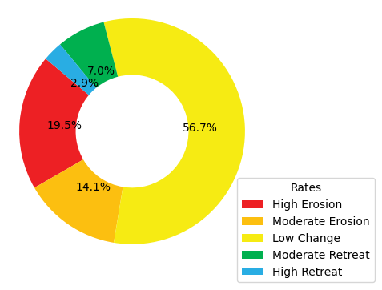
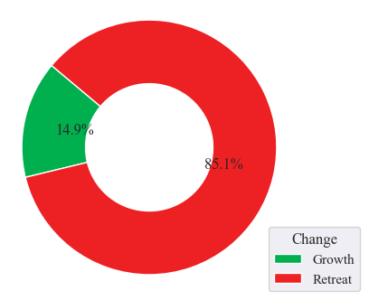

SHORELINE
==========

=============
Introduction
=============

Shoreline extraction is the process of identifying the position of the land-water interface in satellite images.
It is an important task for various applications, such as coastline change detection and coastal zone management.
The task of shoreline extraction is very difficult, time-consuming, and sometimes impossible for entire coastal systems 
when using traditional ground survey techniques.

 Advanced remote sensing (RS) and geographic information system (GIS) techniques are being used for detection of shoreline position and change analysis.
 For accurate subpixel accuracy for characterising the shoreline changes, an automated way/tool for shoreline extraction in required.

 In general, the shoreline extraction process involves obtaining satellite images, pre-processing the data, and applying machine learning algorithms to extract the shoreline.

----------------------------------------------------------------------------
 How accurate are the machine learning algorithms in extracting shorelines?
----------------------------------------------------------------------------
 The accuracy of machine learning algorithms in shoreline extraction depends on various factors such as quality of the satellite images, the complexity of the shoreline, and the type 
 of machine learning algorithm used.

 For instance, a study by Celik and Gazioglou (2022) assessed the accuracy of three machine learning classifier groups (Support Vector Machines, Multilayer Perceptron (MLP), 
 and Ensemble Learning classifiers) on different coastal types for coastline extraction. The authors tested four kernel functions and four activation functions and found that 
 the Random Forest algorithm had better accuracy than the SVM algorithm. The overall accuracy values of all maps were 97.18%, and the kappa coefficient was 0.97 for RF algorithm, 
 while for SVM algorithm, the mean overall accuracy and kappa coefficient of maps were 85.15% and 0.79, respectively 

Another study by Zhang et al. (2019) proposed a deep learning-based method for shoreline extraction from Sentinel-2 images. The authors used a U-Net architecture with a ResNet-50 encoder to 
extract shorelines from Sentinel-2 images. The proposed method achieved an overall accuracy of 96.7% on a test dataset.

However, it is important to note that the accuracy of machine learning algorithms in shoreline extraction is not always perfect and can be affected by various factors such as weather conditions, 
image quality, and other environmental factors. Therefore, it is important to validate the results of any machine learning algorithm with ground truth data or other reliable sources.

--------------------------------------------------------------------
Challenges in automated shoreline Extraction
--------------------------------------------------------------------
Automated shoreline extraction is a complex task that involves several challenges. Some of these challenges include:

   - **Image quality:** The quality of the satellite images can affect the accuracy of the shoreline extraction process. Poor image quality can lead to errors in the detection of the shoreline.
   - **Shoreline complexity:** The complexities of the shoreline has been the major challenge in the automatic shoreline process especially the coastlines of Madagascar which has complex geometries coupled with many inlets and bays.
   - **Weather conditions:** Weather conditions such as cloud cover, fog and haze affects the quality of satellite images especially with optical satellite images which makes it difficult to extract shorelines accurately.
   - **Environmental factors:** Environmental factors such as such as tides, waves, and currents can also affect the accuracy of shoreline extraction.
   - **Machine learning algorithms:** The choice of machine learning algorithm used for shoreline extraction can also affect its accuracy. Different algorithms have different strengths and weaknesses,  and choosing the right one for a particular application is important.
   - **Ground truth data** Validating the results of machine learning algorithms with ground truth data/other reliable sources is important to ensure their accuracy.

----------------------------------
shoreline extraction applications
----------------------------------
Shoreline extraction has several applications in various fields. Some of the applications of shoreline extraction include:

   * **Coastal zone management:** Shoreline extraction can be used to monitor changes in the coastline and assess the impact of human activities on the coastal environment.
   * **Coastal erosion monitoring** It can be used to monitor the rate of coastal erosion and identify areas that are at risk of erosion.
   * **Marine ecology** Shoreline extraction can be used to study the distribution and abundance of marine organisms along the coast.
   * **Coastal engineering** Shoreline extraction can be used to design coastal structures such as breakwaters, jetties, and seawalls.
   * **Navigation** Shorelne extraction can be used to create nautical charts and maps for navigation purposes.

=================
Data Acquisition
=================

Recognizing the paramount role of data in any analysis, this procedure holds utmost significance in the project. Tailoring to the specific requirements reliant on earth observation data, the data for this project was sourced from Google Earth Engine. Given the workflow specifications and the need for optimal accuracy in the outputs, high-resolution imagery is the most practical choice. In this context, Sentinel-2 data is the preferred option due to its 10-meter resolution, as opposed to Landsat's 30 meters. Considering the shoreline extraction requirements using both RADAR and Optical imagery, Sentinel-1 data was also obtained from Google Earth Engine.

For region-specific data acquisition, a 500-meter buffer polygon is generated based on the existing administrative country boundary data, with a specific focus on the coastal shoreline. To reduce computation time, this buffered polygon is subdivided into equally sized grids. These gridded buffers are then uploaded to Google Earth Engine and employed as the region of interest polygons for satellite data retrieval. The satellite data is downloaded for each grid section, and a mosaic of these grids is created to obtain a single image covering the entire area of interest.

====================
Data Pre-processing
====================

Data preprocessing is a fundamental step in a shoreline extraction project using Sentinel-2 satellite imagery data. This process involves several crucial procedures to ensure the data's accuracy and usability for shoreline delineation.

-----------
Sentinel-2
-----------

For a systematic approach to data preprocessing in a shoreline extraction project using Sentinel-2 satellite imagery data, the following procedural steps are employed:

1. ``Radiometric Correction:``

   Sentinel-2 imagery is often affected by atmospheric conditions and sensor artifacts, which can distort the true reflectance values. Radiometric correction, such as top-of-atmosphere (TOA) correction, helps in standardizing the data by removing these atmospheric effects, ensuring that the pixel values reflect the actual surface properties. This correction is essential for accurate shoreline extraction, as it provides a consistent radiometric foundation for analysis.

2. ``Geometric Correction:``

   Geometric distortions can occur in satellite imagery due to factors like terrain relief and Earth's curvature. To extract shorelines accurately, it's vital to ensure that the imagery aligns with accurate geospatial coordinates. Geometric correction involves the removal of distortions and the transformation of the imagery to a common coordinate system, allowing for precise georeferencing.

3. ``Cloud and Shadow Masking:``

   Cloud and shadow masking techniques are often applied to identify and remove unwanted data regions. A cloud masking function is applied on the imagery utilizing the cloud cover band for the removal process. Consequently, the S2-Cloudless imagery is of much relevance in conducting this cloud removal.

By systematically implementing radiometric and geometric correction, along with cloud and shadow masking, Sentinel-2 imagery is prepared for shoreline extraction. This process guarantees that the data is reliable and suitable for accurate coastline delineation in geospatial projects.

-----------
Sentinel-1
-----------

To ensure the quality and suitability of Sentinel-1 satellite imagery data for shoreline extraction, the following procedural steps are undertaken in the data preprocessing phase:

1. ``Radiometric Calibration:``

   Radiometric calibration, which aims to reduce the impact of radiometric distortions in the imagery. Sentinel-1 data can be influenced by various sources of noise, and radiometric calibration aims to standardize the backscatter values, making them more consistent and comparable. This is vital for accurate shoreline extraction, as it ensures that the pixel values represent the actual surface characteristics, allowing for more reliable analysis.

2. ``Geometric Correction:``

   Sentinel-1 data may contain geometric distortions caused by the radar sensor's viewing geometry and Earth's topography. To extract shorelines with precision, it's crucial to ensure that the imagery is accurately georeferenced. Geometric correction involves correcting these distortions and transforming the data into a common coordinate system, enhancing the accuracy of shoreline extraction.

3. ``Speckle Noise Reduction:``

   Speckle noise reduction techniques are often applied to mitigate the impact of unwanted noise in the imagery, improving the overall data quality.

By conducting radiometric calibration, geometric correction, and speckle noise reduction, Sentinel-1 data is well-prepared for shoreline extraction, providing a solid foundation for precise coastline delineation in geospatial projects.

The acquired satellite image is preprocessed with the above satellite image specific procedures to obtain a clean and corrected image for the extraction process.

=====================================
Shoreline Extraction from Sentinel-2 
=====================================

In a shoreline extraction project utilizing Sentinel-2 satellite imagery data, the procedure involves a series of steps to accurately delineate coastlines. The procedures outlined below are applied to the preprocessed composite image.

1. ``Satellite Image reduction using the measures of Central tendencies``

   The mean is the sum of all values in a data set divided by the total number of values. It is sensitive to outliers, meaning that extreme values can have a significant impact on the value of the mean. The mode is the most frequent value in a data set. It is useful for categorical data and can be used for numerical data as well. The median is the middle value in an ordered data set. It is less sensitive to outliers than the mean and is a robust estimator of central tendency.
   In the context of shoreline changes, the median is a good choice if the data is skewed due to spontaneous seasonal/daily/weather influenced fluctuations that could skew the position of the shoreline. For instance, if the shoreline position is measured every day for a year, the daily fluctuations due to tides, storms, and other weather events could cause the shoreline to vary significantly. In this case, the median would be a better measure of central tendency than the mean, as it would not be affected by the extreme values caused by these fluctuations.

2. ``Water Indices Calculation``

      To differentiate land from water, an Automated Water Extraction Index (AWEI) is computed. To overcome the shadow pixel effects on the final distinguishing output, the **AWEInsh** index is utilized since it tends to distinguish the water pixels from the shadow pixels. The index utilizes the BLUE, GREEN, NIR, SWIR1, and the SWIR2 bands. These indices highlight the accurate presence of water bodies, a crucial step for shoreline identification.

         .. code-block:: python

            AWEIsh = Blue + 2.5 × Green − 1.5 × (NIR + SWIR1) − 0.25 × SWIR2

3. ``Thresholding and Classification:``

      Using the water indices, a thresholding process distinguishes between land and water pixels. The thresholding technique utilized is the Otsu thresholding technique. This technique creates histogram values from the AWEInsh generated image, which are then passed onto the Otsu thresholding function to create a dynamic threshold that sets threshold values for distinguishing land and water. Afterward, the image is classified into two pixel values, with 0 representing water and 1 representing land.

4. ``Shoreline Extraction:``

      With the primary focus being on coastal waters, inland waters are removed using an island removal function that utilizes area thresholds to filter out small water bodies from the land. An output of the land-water boundary, showcasing both land and water, is produced. The land-water boundary polygon is converted into a vector layer, resulting in two polygons: one representing the land and the other representing water. The water polygon is removed, leaving only the land boundary from which the boundary extent is extracted. The extracted shoreline is then simplified to obtain a smoother shoreline with simplified edges.

5. ``Validation and Accuracy Assessment:``

      The extracted shoreline is validated against ground truth data to assess its accuracy. Adjustments are made as necessary to improve the results.

6. ``Temporal Analysis:``

      For monitoring changes over time, multiple satellite images captured at different dates are analyzed for each island to identify trends and alterations in the shoreline.

=====================================
Shoreline Extraction from Sentinel-1
=====================================
Shoreline extraction process from sentinel 1 is quite different as that of sentinel-2 which has spectral bands that can be used to compute a water index in the move to distinguish water from non-water surfaces. The process of shoreline extraction from sentinel-1 includes:

1. ``Filter Sentinel-1 Data``

      First you need to download/import sentinel-1 GRD product into your processing environment. This basically comes as an imageCollection of many images of the area of interest. Next is to filter by the relevant polarisation depending on the nature of the study area. In this case, the VH polarisation is chosen as the most ideal for describing variations in volume scattering (from vegetation or water). Further a smoothing function is applied to the filtered data with a focal mediam of a defined radius in meters.

2. ``Apply thresholding``

      An otsu thresholding function which calculates the optimal threshold for binary segmentation based on the input polarisation band histogram. The otsu thresholding technique is basically used to separate an image into foreground and background regions. It is based on the assumption that the image contains two classes of pixels: foreground and backgroung.
      The goal of Otsu's method is to find the threshold value that maximizes the intra-class variance of the two classes.  The algorithm works by computing a histogram of the image intensities and then iterating over all possible threshold values to find the one that maximizes the between-class variance. 
      Once the threshold value is determined, all pixels with intensities greater than or equal to the threshold are assigned to the foreground, while all pixels with intensities less than the threshold are assigned to the background.

3. ``Create a water mask``

      The Otsu threshold function is then used to determine the threshold for water/non-water classification. A binary land-water mask is generated. The water pixels are thereafter masked out to remain with land image that is passed to the shoreline extraction process.

4. ``Shoreline Extraction``

      The water mask image is vectorized to create a polyline boundary of the shoreline, which basically has a stair-like shape. This boundary line is then converted to a smooth shoreline through shape-correction process. The shape-corrected shoreline is treated as the main shoreline for calculating growth and retreat distance and rate per year between the past and present time based on transect method.

Results
========

----------
Mauritius
----------

Shoreline data derived from sentinel-2 imagery in this region reveals a spatial shift in the coastline over the course of two consecutive years. The predominant alteration in the shoreline is characterized by minimal changes, encompassing a substantial 57% of the total variation. Conversely, a significant 24.5% of the shoreline transformation is attributed to a pronounced retreat, with an additional 15.4%, 1.8%, and 1.4% associated with moderate retreat, moderate erosion, and high erosion, respectively. It is worth noting that the Mauritius shoreline exhibits relatively low levels of erosion, which have effectively deterred retreat dynamics, accounting for only 6.6% of the overall transformation. This outcome accentuates the prominence of shoreline expansion, representing a dominant 93.4% of the total change.

-----------
Seychelles
------------

Seychelles exhibits remarkably consistent shoreline transformation rates, showcasing similarities in high erosion, minimal change, and substantial retreat, constituting 25.3%, 26.1%, and 23.2% of the total alterations, respectively. During this six-year span, moderate erosion and moderate retreat gained prominence, contributing 14.4% and 11.0%, respectively, to the shoreline's evolution. Seychelles unravels the enigmatic dance between coastal expansion and withdrawal, with growing areas taking up 46.4% of the narrative, albeit overshadowed by the dominance of retreating regions, accounting for 53.6% of the dynamic alterations.

-----------------------
Mayotte Island-Comoros
-----------------------

The results delineate the shoreline's transformation rates, where high erosion predominantly covers 64.8% of the shoreline changes. Following high erosion, the second most significant change rate is found to be low change, accounting for 12.0% of the alterations. High retreat, moderate erosion, and moderate retreat come next in line, contributing 10%, 9.4%, and 3.9%, respectively, to the total observed changes. This study further highlights a concerning situation, with a substantial portion of the overall shoreline change area undergoing retreat (86.4%), while a small segment represents growth areas, constituting only 13.6% of the observed alterations.

.. image:: images/Mayotte/shorelinechangerate.png
   :align: left
   :width: 45%
.. image:: images/Mayotte/Growthandretreat.png
   :align: right
   :width: 45%

------------------------
Ngazidja Island-Comoros 
------------------------

The results obtained from the shoreline analysis unveil a substantial portion of the shoreline, approximately 46.0%, characterized by low change dynamics, while high erosion influences around 30% of the shoreline. These two predominant rates serve as valuable indicators when anticipating the state of Grande Comore Island's shoreline. Additionally, we observed occurrences of high retreat, moderate erosion, and moderate retreat, each contributing 14.3%, 6%, and 3.8% to the overall shoreline change rate. Significantly, the findings emphasize the prevalence of retreat in the coastal shoreline, primarily due to the substantial impact of erosion on specific shore sections, accounting for 61.5% of the total changes. In contrast, growth dynamics along the coastal shoreline remain limited, representing only 38.5% of the overall change dynamics.

--------------------------------
Nzwani and Mwali Island-Comoros
--------------------------------

An analysis of shoreline changes over six years reveals key patterns. The majority (56.7%) of the shoreline remained stable, while 19.5% experienced high erosion levels, indicating vulnerability. Additionally, around 14.1% displayed moderate erosion, and 7.0% witnessed moderate retreat. Although high retreat levels were less prevalent, the 2.9% with the highest retreat rates highlight significant retreat in specific areas. Retreat processes dominated at 85.1% of the total shoreline changes, supported by high erosion rates exceeding retreat levels. In contrast, 14.9% of changes represented growth dynamics, marking a distinct contrast.

===========
DISCUSSION
===========

----------
Mauritius
----------

Mauritius' coastal shoreline has demonstrated remarkable stability during the observed two-year period. This stability can be primarily attributed to effective measures taken to mitigate the influences of erosion and accretion. Specifically, the establishment of breakwaters along certain sections of the island's shoreline has proven instrumental in shielding it from the potentially adverse effects of wind and waves. Moreover, the implementation of seawalls in the urbanized coastal areas has further bolstered shoreline protection against erosion and accretion, which can result from sediment movements along the coast or tidal waves. These initiatives underscore the government's longstanding commitment to formulating and implementing policies aimed at safeguarding the coastal regions and their surrounding environments.

------------
Seychelles
------------

Predominantly, minimal changes characterize the shoreline, with a harmonious equilibrium maintained between heightened erosion and increased retreat levels. These shoreline dynamics are significantly influenced by the island's diverse coastal ecosystem, playing a synergistic role in these alterations. The presence of human settlements along the shoreline presents a dual-edged impact, notably contributing to coastal erosion along the western segment of the island. This can be attributed, in part, to the extraction of sediments for construction purposes, rendering the shoreline susceptible to erosion. Conversely, the human settlement factor contributes to shoreline accretion levels, given that construction activities introduce artificial elements that exert influence on sediment transport and sediment entrapment. These artificial features can foster accretion zones while concurrently safeguarding neighboring areas from erosion processes.

--------------------------
Mayotte Island-Comoros
--------------------------

The island of Mayotte grapples with the significant challenge of high erosion levels, stemming from a multifaceted set of factors, prominently including human settlements along its coastal areas. This assertion gains substantial support from research findings, which prominently reveal heightened erosion trends across a substantial portion of the island's coastal settlements. Furthermore, the erosive impacts of tidal wave actions upon the shoreline play a pivotal role in exacerbating this situation. The absence of a biologically diverse shoreline landscape further compounds the predicament by rendering the coastline devoid of natural protective buffers, thus leaving it exposed and susceptible to erosion. This discerning analysis of the results accentuates the pressing need for proactive management strategies to harmonize coastal development endeavors with the imperatives of environmental preservation.

-------------------------
Ngazidja Island-Comoros
--------------------------

A substantial portion of Ngazidja's coastal shoreline remained remarkably stable over the observed years, with minimal changes or, in some cases, virtually no alterations. This observation can be attributed to the distinctive composition of Ngazidja’s coastline, characterized predominantly by sandy beaches and ancient volcanic lava flows along the northern, northeastern, and southeastern sectors. These geological features render these shoreline sections more susceptible to erosion and wave-induced actions. Furthermore, the presence of rocky cliffs and shallow reefs, primarily located along the western and southwestern segments, enhances the shoreline's resilience to the potential effects of rising sea levels. The juxtaposition of these two distinctive geological elements contributes to a state of equilibrium in the dynamics of change, counterbalancing the forces of erosion and accretion. Nonetheless, it is worth noting that while a significant portion of the shoreline maintains a state of low change, certain sections exhibit a predisposition to high erosion and limited accretion.

--------------------------------
Nzwani and Mwali Island-Comoros
--------------------------------

Similarly, to Ngazidja, the shoreline dynamics of Nzwani and Mwali primarily exhibited a state of low change as the dominant pattern. This pattern is underpinned by several factors that influence these coastal areas. Notably, both Nzwani and Mwali feature extensive mangrove vegetation along their shorelines, which serves as a natural defense against the impacts of waves and storm surges, effectively mitigating their effect on the coast. Furthermore, these mangroves play a vital role in sediment capture, reducing the erosive potential caused by sediment movement. The application of rigorous coastal management strategies also contributes to this pattern, encompassing initiatives such as the construction of seawalls and breakwaters in various shoreline sections. A compelling example of these measures can be observed in Mutsamudu, the capital city of Nzwani.

===========
Conclusion
===========

The shoreline change analysis focuses on automated shoreline extraction using high-resolution satellite imagery. Utilizing Sentinel-2 and Sentinel-1 data from Google Earth Engine, the project ensures accurate coastline delineation through data acquisition, preprocessing, and extraction steps. The benefits of the project include:

**Accurate Analysis**
By employing radiometric and geometric correction techniques, along with cloud and shadow masking, the satellite imagery is prepared for shoreline extraction, ensuring reliable and precise analysis.

**Environmental Protection**
The analysis highlights the importance of proactive measures, such as breakwaters, seawalls, and mangrove preservation, to safeguard coastal regions against erosion and accretion. This demonstrates a commitment to balancing coastal development with environmental preservation.

**Insights into Shoreline Dynamics**
Results from different regions, such as Mauritius, Seychelles, Mayotte Island-Comoros, Ngazidja Island-Comoros, and Nzwani and Mwali Islands-Comoros, reveal patterns of shoreline transformation rates, facilitating a better understanding of dynamics like erosion, retreat, and growth. These insights can inform strategies for coastal management and adaptation to changing conditions.

The project utilizes advanced remote sensing techniques to provide accurate shoreline extraction, while emphasizing the importance of environmental preservation and sustainable coastal management.
